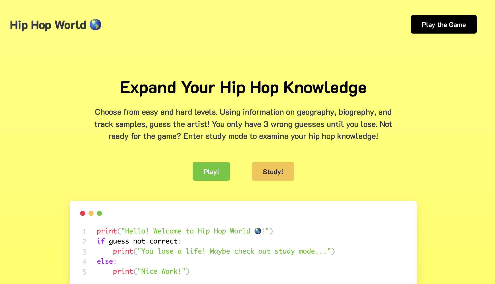
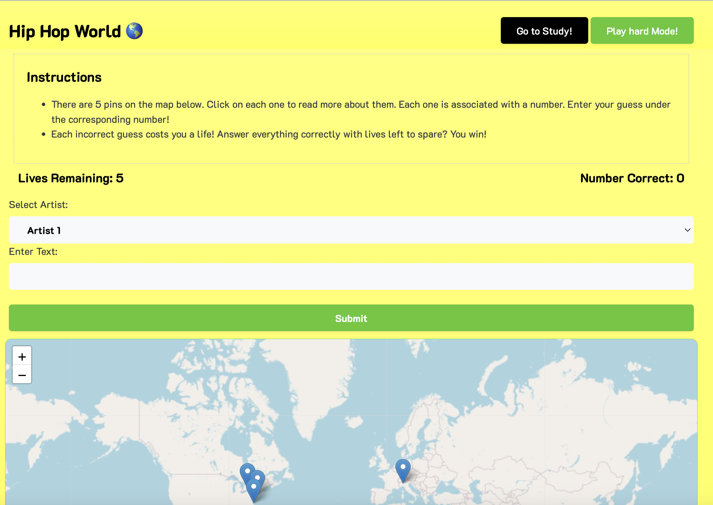
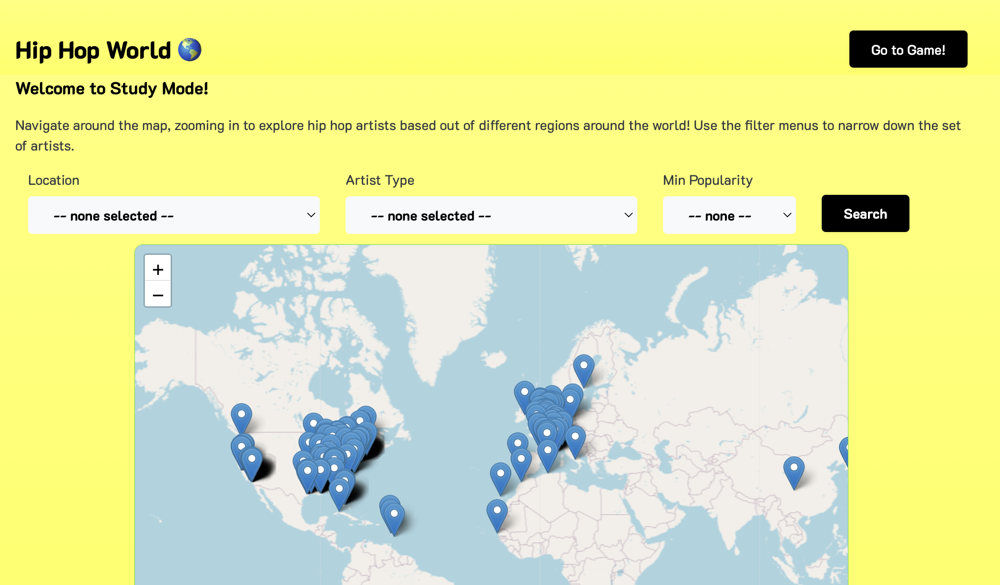

# Hip Hop World 🌎

This web application provides a simple and fun way to expand your hip hop knowledge. The app supports two different modes: Study and Play. In Study Mode, you can look at a world map of around 600 hip hop artists. Click on individual pins to read more about the artist and watch a YouTube video of them. Think you're ready for a challenge? Go into Play Mode, where you can choose either a difficulty of easy or hard. In the game, 5 pins will appear on the map. Each pin contains a number and a anonymous description of the artist. Using information like their home city, famous songs, and date of birth, can you come up with the artist? If you make 5 incorrect guesses, you lose. But, if you get all 5 before you run out of lives, you'll be a winner!

**Home Screen**:

**Play Mode**:

**Study Mode**:

